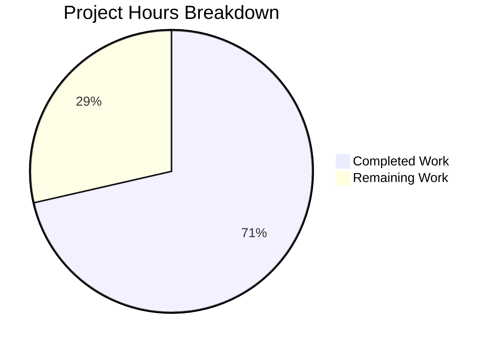

# Project Guide — Express.js Tutorial Server

## 1. Executive Summary

**Project completion: 5 hours completed out of 7 total hours = 71% complete.**

This greenfield Node.js + Express.js tutorial project was built from an empty repository containing only a placeholder `README.md`. All three core requirements specified in the Agent Action Plan have been fully implemented and verified:

| Requirement | Status |
|---|---|
| Node.js server with Express.js framework | ✅ Complete |
| `GET /` returning `"Hello world"` (HTTP 200) | ✅ Complete |
| `GET /evening` returning `"Good evening"` (HTTP 200) | ✅ Complete |

**Key achievements:**
- Express.js 4.22.1 server fully operational with both endpoints
- 7 out of 7 integration tests passing (Jest + Supertest)
- Runtime verified: both endpoints return correct responses
- Zero npm audit vulnerabilities
- Clean working tree — all changes committed

**Remaining work (2 hours):** Human review tasks including code review/PR merge, production environment configuration, README documentation, and optional CI/CD setup. No functional defects or blockers exist.

---

## 2. Validation Results Summary

### 2.1 Final Validator Outcome: ALL CHECKS PASSED

The Final Validator confirmed production-readiness with zero issues remaining.

### 2.2 Dependency Installation — ✅ 100% Success

| Package | Version | Type | Status |
|---|---|---|---|
| express | 4.22.1 | Production | ✅ Installed |
| jest | 30.2.0 | Dev | ✅ Installed |
| supertest | 7.2.2 | Dev | ✅ Installed |

- `npm ls` reports zero missing or extraneous packages
- `npm audit` reports 0 known vulnerabilities

### 2.3 Compilation — ✅ 100% Success

- All Node.js modules load without errors
- `require('./index')` succeeds; Express app instance exports correctly
- No syntax errors or module resolution failures

### 2.4 Tests — ✅ 7/7 Passing (100%)

```
PASS __tests__/index.test.js
  Express Server Endpoints
    GET /
      ✓ should return 200 status code (60 ms)
      ✓ should return "Hello world" as the response body (15 ms)
    GET /evening
      ✓ should return 200 status code (16 ms)
      ✓ should return "Good evening" as the response body (13 ms)
    GET /undefined-route
      ✓ should return 404 for non-existent routes (20 ms)
    POST /
      ✓ should return 404 for POST on root endpoint (11 ms)
    POST /evening
      ✓ should return 404 for POST on /evening endpoint (13 ms)

Test Suites: 1 passed, 1 total
Tests:       7 passed, 7 total
```

### 2.5 Runtime Validation — ✅ 100% Success

| Endpoint | Method | Expected Status | Actual Status | Expected Body | Actual Body | Result |
|---|---|---|---|---|---|---|
| `/` | GET | 200 | 200 | `Hello world` | `Hello world` | ✅ Pass |
| `/evening` | GET | 200 | 200 | `Good evening` | `Good evening` | ✅ Pass |
| `/nonexistent` | GET | 404 | 404 | — | — | ✅ Pass |

### 2.6 Fixes Applied During Validation

None required — all files were correctly implemented by prior agents on the first pass.

---

## 3. Hours Breakdown and Completion Calculation

### 3.1 Completed Hours (5h)

| Component | Hours | Details |
|---|---|---|
| Research & project initialization | 1.0h | Express.js version research, package.json creation, .gitignore setup, npm dependency installation |
| Express server implementation | 1.5h | index.js (29 lines) — 2 GET endpoints, conditional listener, module export |
| Test suite development | 1.5h | 7 test cases across 57 lines — Jest + Supertest setup and implementation |
| Dependency management | 0.5h | npm install, lock file generation, dependency tree verification |
| Validation & runtime testing | 0.5h | Test execution, manual endpoint verification, npm audit |
| **Total Completed** | **5.0h** | |

### 3.2 Remaining Hours (2h)

| Task | Hours | Details |
|---|---|---|
| Code review and PR approval | 0.5h | Human review of 4 created files, approve and merge PR |
| Production environment configuration | 0.5h | Configure PORT environment variable, host binding, process manager |
| README.md documentation | 0.5h | Add project description, setup instructions, API endpoint documentation |
| CI/CD pipeline setup | 0.5h | Configure GitHub Actions or similar for automated testing on push |
| **Total Remaining** | **2.0h** | |

### 3.3 Completion Calculation

```
Completed Hours:  5h
Remaining Hours:  2h
Total Hours:      7h
Completion:       5 / 7 = 71%
```

### 3.4 Visual Representation



---

## 4. Git Repository Analysis

### 4.1 Branch Information

- **Feature branch:** `blitzy-39154b11-528c-427d-97e8-3dd05652b86e`
- **Base branch:** `main` (initial commit: `608d788`)
- **Working tree:** Clean — no uncommitted changes

### 4.2 Commit History (4 feature commits)

| Hash | Author | Message |
|---|---|---|
| `85ed4af` | Blitzy Agent | Setup: Initialize Node.js project with Express.js, Jest, and Supertest dependencies |
| `cdaaf40` | Blitzy Agent | Create package.json: Node.js project manifest with Express 4.22.1, Jest 30.2.0, Supertest 7.2.2 |
| `739010c` | Blitzy Agent | Create index.js: Express.js server with GET / and GET /evening endpoints |
| `435bc0f` | Blitzy Agent | Add Jest + Supertest integration tests for Express.js server endpoints |

### 4.3 File Change Summary

| File | Action | Lines Added |
|---|---|---|
| `.gitignore` | Created | 1 |
| `__tests__/index.test.js` | Created | 57 |
| `index.js` | Created | 29 |
| `package-lock.json` | Created (auto-generated) | 5,516 |
| `package.json` | Created | 19 |
| **Total** | **5 files created** | **5,622 lines** |

Hand-written source code: 106 lines (index.js: 29, index.test.js: 57, package.json: 19, .gitignore: 1)

---

## 5. Detailed Human Task Table

All remaining tasks are human review/configuration items. No functional defects or blockers exist.

| # | Task | Priority | Severity | Hours | Confidence | Action Steps |
|---|---|---|---|---|---|---|
| 1 | **Code review and PR approval** | High | Medium | 0.5h | High | Review `index.js` (29 lines), `__tests__/index.test.js` (57 lines), and `package.json` (19 lines). Verify endpoint logic matches requirements. Approve and merge PR. |
| 2 | **Production environment configuration** | Medium | Low | 0.5h | High | Set `PORT` environment variable for deployment target. Configure process manager (PM2 or systemd) for auto-restart. Bind to `0.0.0.0` if needed for external access. |
| 3 | **README.md documentation** | Low | Low | 0.5h | High | Add project description, prerequisites (Node.js 20.x), installation steps (`npm install`), run instructions (`node index.js`), and API endpoint documentation. |
| 4 | **CI/CD pipeline setup** | Low | Low | 0.5h | High | Create `.github/workflows/test.yml` (or equivalent) to run `npm install && npm test` on push/PR events. |
| | **Total Remaining Hours** | | | **2.0h** | | |

---

## 6. Comprehensive Development Guide

### 6.1 System Prerequisites

| Component | Required Version | Verification Command |
|---|---|---|
| Node.js | v18.x or v20.x (LTS) | `node --version` |
| npm | v9.x or later | `npm --version` |

The project was developed and tested with Node.js v20.20.0 and npm 11.1.0.

### 6.2 Environment Setup

```bash
# 1. Clone the repository and switch to the feature branch
git clone <repository-url>
cd 12_feb-_6
git checkout blitzy-39154b11-528c-427d-97e8-3dd05652b86e
```

No environment variables are required for local development. Optionally set:
```bash
# Optional: Override default port (default is 3000)
export PORT=3000
```

### 6.3 Dependency Installation

```bash
# Install all dependencies (production + dev)
npm install
```

**Expected output:** No errors. Verify with:
```bash
npm ls
```
**Expected:**
```
12-feb--6@1.0.0
├── express@4.22.1
├── jest@30.2.0
└── supertest@7.2.2
```

### 6.4 Running the Test Suite

```bash
# Run all 7 tests with verbose output
NODE_ENV=test npx jest --forceExit --detectOpenHandles --verbose
```

**Expected output:** 7 passing tests (GET / status + body, GET /evening status + body, 404 undefined route, POST / rejection, POST /evening rejection).

Alternatively, use the npm script:
```bash
npm test
```

### 6.5 Starting the Application

```bash
# Start the server (default port 3000)
node index.js
```

**Expected console output:**
```
Server is running on http://localhost:3000
```

To run on a custom port:
```bash
PORT=8080 node index.js
```

### 6.6 Verification Steps

After starting the server, verify both endpoints:

```bash
# Test the root endpoint
curl http://localhost:3000/
# Expected: Hello world

# Test the evening endpoint
curl http://localhost:3000/evening
# Expected: Good evening

# Verify 404 for undefined routes
curl -s -o /dev/null -w "%{http_code}" http://localhost:3000/nonexistent
# Expected: 404
```

### 6.7 Project Structure

```
12_feb-_6/
├── .gitignore              # Excludes node_modules/
├── README.md               # Placeholder project heading
├── __tests__/
│   └── index.test.js       # 7 integration tests (Jest + Supertest)
├── index.js                # Express.js server (2 GET endpoints)
├── node_modules/           # Installed dependencies
├── package-lock.json       # Dependency lock file
└── package.json            # Project manifest and scripts
```

### 6.8 Troubleshooting

| Issue | Cause | Resolution |
|---|---|---|
| `EADDRINUSE: address already in use :::3000` | Port 3000 is occupied by another process | Kill the existing process or use `PORT=3001 node index.js` |
| Tests hang / don't exit | Missing `--forceExit` flag | Use `NODE_ENV=test npx jest --forceExit --detectOpenHandles` |
| `Cannot find module 'express'` | Dependencies not installed | Run `npm install` |

---

## 7. Risk Assessment

### 7.1 Technical Risks

| Risk | Severity | Likelihood | Mitigation |
|---|---|---|---|
| Express 4.x enters end-of-life | Low | Low | Express 4.x is in active maintenance with security patches. Upgrade to Express 5.x when ready; the API is largely backward-compatible. |
| No graceful shutdown handler | Low | Low | For tutorial scope, this is acceptable. For production, add `process.on('SIGTERM', ...)` to cleanly close the server. |

### 7.2 Security Risks

| Risk | Severity | Likelihood | Mitigation |
|---|---|---|---|
| No rate limiting | Low | Low | Acceptable for tutorial. For production, add `express-rate-limit` middleware. |
| No security headers (helmet.js) | Low | Low | Acceptable for tutorial. For production, add `helmet` middleware. |
| No CORS configuration | Low | Low | Not needed for server-rendered responses. Add `cors` middleware if building an API consumed by browsers. |

### 7.3 Operational Risks

| Risk | Severity | Likelihood | Mitigation |
|---|---|---|---|
| No process manager | Low | Medium | Server will not auto-restart on crash. For production, use PM2 (`pm2 start index.js`) or systemd. |
| No structured logging | Low | Low | Uses `console.log` only. For production, integrate `pino` or `winston`. |
| No health check endpoint | Low | Low | Add `GET /health` returning 200 for load balancer health probes. |

### 7.4 Integration Risks

No external service dependencies exist. The application is fully self-contained with zero integration risk.

---

## 8. Consistency Verification

```
✅ Executive Summary states: 71% complete (5h completed out of 7h total)
✅ Pie chart values: Completed Work = 5, Remaining Work = 2 → 71.4% / 28.6%
✅ Task table sum: 0.5 + 0.5 + 0.5 + 0.5 = 2.0h = Remaining Work in pie chart
✅ Formula shown: 5 / 7 = 71%
✅ All prose references use 71% consistently
✅ No conflicting statements found
```